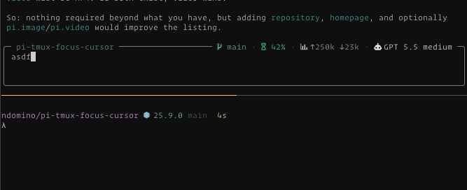
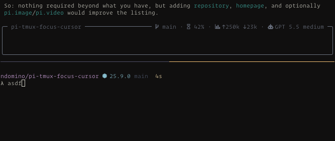

# pi-tmux-cursor-focus

A Pi extension that hides the editor cursor in unfocused tmux panes.

It wraps the active Pi editor instead of replacing it, so it works alongside other prompt/status-bar extensions.

> ### Focused
>   
>   
> ### Unfocused 
>   
> Also using the [pi-glance](https://pi.dev/packages/pi-glance) extension

## What it does

- Detects the current `TMUX_PANE`.
- Installs tmux focus hooks for that pane.
- Hides Pi's fake editor cursor when the pane loses focus.
- Restores the cursor when focus returns.
- Keeps any existing editor wrapper instead of replacing it.

## Installation

```bash
pi install npm:pi-tmux-cursor-focus
```

Or test without installing

```bash
pi -e npm:pi-tmux-cursor-focus
```

### tmux setup

Enable tmux focus events:

```tmux
set -g focus-events on
```

Reload tmux after changing the config:

```bash
tmux source-file ~/.tmux.conf
```


## License

MIT
